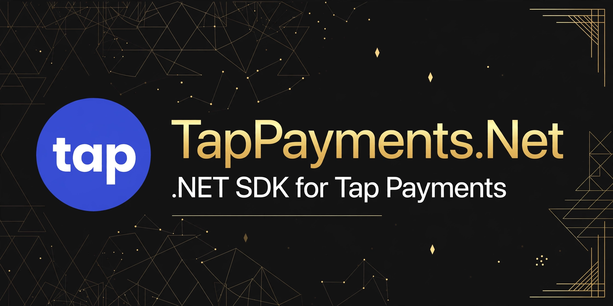

[](LICENSE)
[](https://dotnet.microsoft.com/)
[](https://github.com/SENESO/TapPayments.Net/stargazers)
[](https://www.nuget.org/packages/TapPayments.Net)

# TapPayments.Net

The missing .NET SDK for **Tap Payments** — the payment gateway powering 100,000+ businesses across MENA (cards, mada, KNET, Benefit, Apple Pay, Google Pay).

```csharp
using TapPayments;
using TapPayments.Models;

var client = new TapClient("sk_test_...");

// Create a charge — for 3DS / local schemes the response is INITIATED
// with a transaction.url: redirect the customer there.
var charge = await client.CreateChargeAsync(new CreateChargeRequest
{
    Amount = 150,
    Currency = "SAR",
    Description = "Order #1234",
    Customer = new TapCustomer
    {
        FirstName = "Ahmed",
        LastName = "Ali",
        Email = "ahmed@example.com",
        Phone = new TapPhone { CountryCode = "966", Number = "500000001" }
    },
    Source = new TapSource { Id = TapSources.All }, // hosted checkout
    Redirect = new TapRedirect { Url = "https://myshop.com/payment/return" },
    Post = new TapPost { Url = "https://myshop.com/payment/webhook" } // the reliable signal
});

if (charge.IsPendingRedirect)
    return Redirect(charge.Transaction.Url);
```

> **Always set `post.url`.** Browser redirects are unreliable; the webhook is the only guaranteed notification of the final state.

## Authorize then capture

```csharp
// Hold funds without capturing (credit cards only)
var auth = await client.CreateAuthorizationAsync(new CreateAuthorizationRequest
{
    Amount = 500,
    Currency = "SAR",
    Customer = new TapCustomer { FirstName = "Ahmed", Email = "ahmed@example.com" },
    Source = new TapSource { Id = "tok_..." }, // single-use token
    Redirect = new TapRedirect { Url = "https://myshop.com/payment/return" },
    Post = new TapPost { Url = "https://myshop.com/payment/webhook" }
});

// ...later: capture the full or partial amount
var captured = await client.CaptureAuthorizationAsync(auth.Id, amount: 450, currency: "SAR");

// ...or release the hold
await client.VoidAuthorizationAsync(auth.Id);
```

Auto capture/void windows are also supported:

```csharp
Auto = new TapAuto { Type = "VOID", Time = 48 } // auto-void after 48h (1–168h)
```

## Refunds

```csharp
var refund = await client.CreateRefundAsync(new CreateRefundRequest
{
    ChargeId = "chg_...",
    Amount = 50,          // partial refund; omit amount handling for full
    Currency = "SAR",
    Reason = "Customer requested"
});
```

## Tokens

Tokens are single-use and expire within minutes — never store or reuse them.

```csharp
var token = await client.CreateTokenAsync(new CreateTokenRequest
{
    Card = new TapCardDetails
    {
        Number = "4111111111111111",
        ExpMonth = 12, ExpYear = 2028, Cvc = "123",
        Name = "Ahmed Ali"
    }
});

// A saved card.id can NEVER be used as source.id — tokenize it first:
var reuse = await client.CreateTokenFromSavedCardAsync(new CreateTokenFromSavedCardRequest
{
    SavedCard = new TapSavedCard { CardId = "card_...", CustomerId = "cus_..." }
});
```

## Customers

```csharp
var customer = await client.CreateCustomerAsync(new CreateCustomerRequest
{
    FirstName = "Ahmed",
    LastName = "Ali",
    Email = "ahmed@example.com"
});

var stored = await client.RetrieveCustomerAsync(customer.Id);
```

## Webhook validation

Every webhook carries a `hashstring` header — HMAC-SHA256 of a canonical field string, keyed with your **secret API key**. Verify before acting on any payload:

```csharp
using TapPayments.Webhooks;

bool ok = TapWebhookValidator.IsValid(
    jsonPayload: rawBody,
    hashstringHeader: Request.Headers["hashstring"],
    secretKey: "sk_live_...",
    objectType: "charge" /* charge | authorize | refund | invoice */);

if (!ok) return Unauthorized();
```

The canonical string follows Tap's official scheme (`x_id…x_amount…x_currency…x_gateway_reference…x_payment_reference…x_status…x_created`), with the amount formatted to the currency's ISO decimals (3 for BHD/KWD/OMR/JOD, 2 for the rest).

## ASP.NET Core DI

```csharp
builder.Services.AddTapPayments("sk_test_...");
// ...or
builder.Services.AddTapPayments(o =>
{
    o.SecretKey = builder.Configuration["Tap:SecretKey"];
});
```

## Test mode

Tap keys are self-serve from the Tap dashboard — `sk_test_...` for sandbox, `sk_live_...` for production. Integration tests use `TAP_SECRET_KEY` from the environment and skip gracefully when it is absent.

## License

MIT — see [LICENSE](LICENSE).
